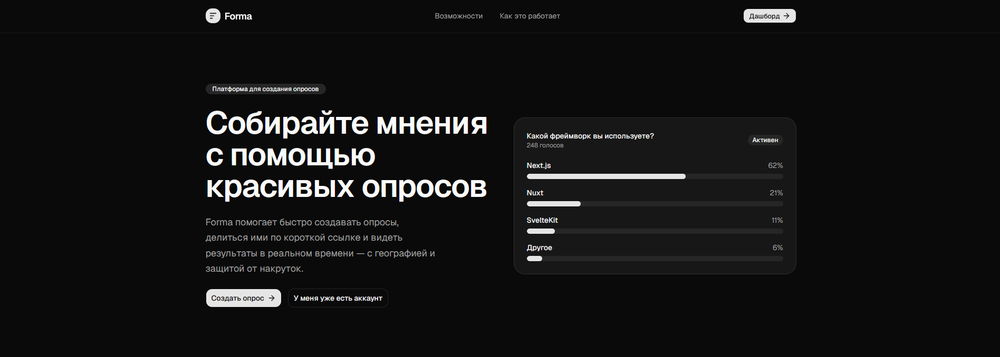

# Forma


Forma is a small poll service with a Go backend and a Next.js frontend.

## Stack

- Backend: Go, Gin, SQLite, JWT
- Frontend: Next.js, React, TypeScript, Tailwind CSS

## Features

- user registration and login
- poll creation with multiple questions
- question types:
  - single choice
  - multiple choice
  - text answer
- public poll page by short link
- vote protection by IP and guest token
- auth-only polls
- poll statistics for the author
- vote geography via GeoIP

## Project structure

```text
cmd/server/      backend entry point
internal/        backend code
migrations/      SQL migrations
frontend/        Next.js frontend
data/            SQLite and GeoIP data
```

## Docker Setup

`docker-compose up -d --build`

For add domain edit ./Caddyfile:

```
your-domain-here.com {
    reverse_proxy /api/* backend:8080
    reverse_proxy frontend:3000
}
```

## Notes

- backend routes use the `/api` prefix
- frontend talks to backend through the Next.js `/api` proxy
- backend should be started from the repository root
- GeoIP database file is required: `./data/GeoLite2-Country.mmdb`
